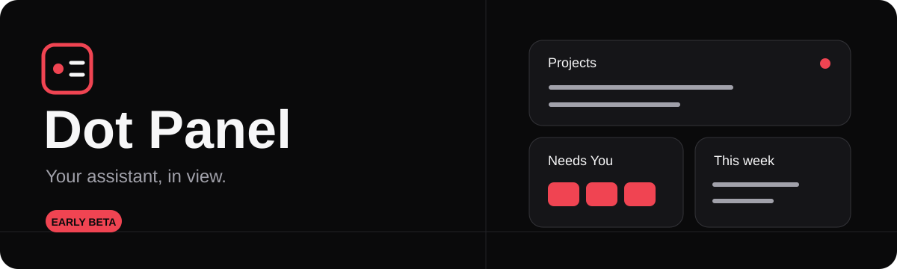

<div align="center">



**Projects in view. Decisions within reach.**

[](https://github.com/graydeon/dot-panel/releases/tag/v0.1.0-beta.1)
[](LICENSE)
[](https://github.com/graydeon/dot-panel/actions/workflows/ci.yml)
[](https://github.com/graydeon/dot-panel/actions/workflows/docs.yml)

[↓ **Get the beta**](https://github.com/graydeon/dot-panel/releases/tag/v0.1.0-beta.1) · [⚙ **Setup**](docs/agent-setup-protocol.md) · [▦ **Widget skills**](agent-skills/README.md) · [⌘ **Source**](https://github.com/graydeon/dot-panel) · [♡ **Security**](SECURITY.md)

</div>

## Your assistant, in view

A free, AGPL framework for your dot to create and personalize its own private touch dashboard in ChatGPT Sites, optionally linked in Spaces. Bundled setup, maintenance and widget skills guide the work; each owner keeps their own panel. Questions appear only while pending. Once an answer is saved, the panel returns to project status. The assistant's name is an owner setting; Dot Panel is the product name.

> **Early beta:** reusable source is public; the existing hosted panel stays private. Fresh-user installation and end-to-end setup with a new owner's data have not been independently validated. Public catalog distribution is unverified. There is no universal one-click plugin install link.

## In the panel

| Module | What you get |
| --- | --- |
| **Needs You** | Two-to-six-choice ordinary decisions in a queue and accessible modal. Later keeps a request pending; Dismiss removes it without answering. |
| **Projects** | Timestamped status, chosen source modules, and honest empty states. |
| **Calendar** | Today / Week cards and a Month / Week / Day dialog over saved snapshots, with timezone and coverage. |
| **Usage** | Snapshot bars, reset dates, optional reset availability, and source timestamps. |
| **Your layout** | Portrait and landscape layouts, templates, paging, touch controls, Save / Cancel, and restore. |

<details>
<summary><strong>Explore all features</strong></summary>


- Independent Needs You queue with centered touch-answer dialogs, Later, persistent Dismiss, and exact-event history
- Owner-reviewed project/source modules with timestamps and honest empty states
- Saved portrait/landscape widget layouts: edit-only drag/resize, tap controls, swap, templates, paging, Save/Cancel, and previous-layout restore
- Compact Today and Week widgets opening a Month/Week/Day calendar dialog
- Owner-private calendar snapshots with timezone/DST handling and explicit date coverage
- Compact usage bars, reset dates, optional reset availability/expiry, and separate source timestamps
- Light/dark themes remembered on the device
- Source-configured reference and briefing links; no arbitrary API credential forms
- D1 ownership, duplicate protection, subscriptions, transactional outbox and signed MCP Events
- Agent-led first-run setup protocol and source-edit widget creation/editing skills
- Original editable SVG brand kit

</details>

This repository contains reusable source, not anyone's live dashboard, private links, data, credentials, or deployment history.

See the [v1 readiness ledger](docs/v1-readiness.md) for verified checks and remaining gates.

## Set up your own panel

Start with [Framework installation](docs/framework-installation.md). Your dot needs the supported Sites tools and a workspace that can build the source. It creates a new private Site using the sanitized template, reuses Sites-managed sign-in and connects the private Site plugin provisioned for you. A one-time Install/Connect step and authorized answer-event subscription may need your action. No developer-operated service, subscription or external login provider is required by this architecture.

The public installer package is still being verified; do not treat the beta source archive as an installable plugin. Skills guide available tools; they cannot create missing capabilities or bypass your account policy.

## Quickstart · local development

Node.js 22.13+ (Node 24 recommended), React, TypeScript, Vite, Cloudflare Workers, and D1.

```sh
git clone https://github.com/graydeon/dot-panel.git
cd dot-panel
npm ci
npm test
npm run test:runtime
npm run test:template
npm run test:recovery
npm run build
```

To preview the UI and local Worker:

```sh
cp .dev.vars.example .dev.vars
npm run build
npx wrangler d1 migrations apply DB --local
npm run worker:dev
```

Open the local URL printed by Wrangler. The local-only fixture identity is explicit; the application does not seed a question or project data. Use the MCP tools against `/mcp` to populate your own development state. `npm run dev` starts the frontend with `/api` and `/mcp` proxied to the local Worker on port 8787.

Briefing and other destinations are owner-scoped module links configured through the setup workflow. They are not compiled into the frontend.

## Runtime and authentication boundaries

**User-owned Sites is the intended setup.** `worker/sites.ts` is the dedicated Sites entrypoint and uses the authenticated Site-scoped identity supplied by the hosting boundary. Sites manages the private plugin's OAuth. Build with `npm run build:sites`; the supported Sites workflow then registers the user's new private Site, adds logical `DB` and MCP capability metadata, applies migrations and publishes. Never bind this entrypoint directly to an unrestricted public Worker: its trusted headers are only trustworthy behind Sites.

**Standalone development remains available.** `worker/index.ts` rejects client identity headers and requires a trusted `AUTHENTICATOR` binding for an independently hosted deployment. This optional boundary is not an installer prerequisite or a bundled OAuth service. Without verification, private data routes return 401; slow or invalid verification fails closed. Local fixture identity works only on localhost and must not be deployed.

Neither build command provisions hosting, grants access, installs plugins or copies existing personal data. Keep the generated Site identity and credentials outside reusable templates. Read [setup](docs/framework-installation.md) and [recovery](docs/operations.md) before changing an existing panel.

## Tools

- `get_touch_status`: pending queue, compatible current-question fields, delivery state, overview, and owner dot name
- `get_touch_answer`: exact historical answer and acknowledgement by event ID
- `set_touch_question`: replace the current question with two to six choices, using a version guard and request ID
- `enqueue_touch_question`: add an independent ordinary decision with two to six choices
- `cancel_touch_question`: cancel a specific queued revision without deleting history
- `get_calendar_snapshot` / `update_calendar_snapshot`: read/store authorized calendar snapshots
- `get_usage_snapshot` / `update_usage_snapshot`: read/store scoped usage snapshots and optional reset records
- `get_panel_setup_status`: owner-scoped guided setup evidence and freshness; external connection tests remain required
- `get_panel_config` / `update_panel_config`: versioned owner-reviewed source configuration
- `get_panel_layout`: read saved geometry and current widget registry
- `acknowledge_touch_answer`: explicitly acknowledge one event after handling it
- `retry_touch_delivery`: attempt due pending deliveries
- `update_touch_overview`: update factual status with source timestamps and a concurrency guard
- `set_dot_display_name`: configure the current owner's assistant name

The browser also offers a one-time name setup control when that setting is empty. These names are display settings, not identity or authorization inputs.

## Events and delivery guarantees

Event: `answer.submitted`. Subscribe with `{}` for all of the authenticated owner's questions, or an optional `question_id` filter. Payload fields are `event_id`, `question_id`, `question_version`, `question`, `choice_id`, `answer`, and `saved_at`.

Subscriptions require an allowed HTTPS destination and a signed, echoed challenge. The current exact callback-host allowlist covers ChatGPT's observed official delivery hosts; unknown hosts fail closed. Expand it only after independently verifying a trusted receiver. No redirects are followed. Callback secrets are stored only server-side.

An answer and its delivery outbox are saved atomically. Retry attempts preserve the event ID. A 2xx callback response means receipt, not that the assistant replied. Explicit acknowledgement is a separate field.

Retries are request-driven: the open page checks periodically, and the retry tool can resume due work. There is **no background delivery guarantee when the page is closed**, and attempts are capped at eight. Answers saved before a subscription exists are not replayed automatically. A production deployment may add a supported durable scheduler, but this repository does not pretend one exists.

Before acting on a received event, retrieve that exact event ID and check whether it was already acknowledged. Never treat a tap as approval for payments, permissions, credentials, or other consequential actions.

Layout writes use the authenticated same-origin `/api/layout` endpoint with layout and module-version guards; there is no MCP layout writer. Read [the setup protocol](docs/agent-setup-protocol.md) and [widget skills](agent-skills/README.md) before extending the app. Calendar and usage are snapshots, not direct server-side Google/account adapters. Scheduled ingestion requires separately authorized connected tools.

## Beta boundaries

- **Your own private Site:** the setup skill uses available Sites tooling and managed sign-in. Only optional independently hosted Worker deployments require a separate trusted `AUTHENTICATOR`; local fixture identities must never be hosted.
- **Bring authorized sources:** calendar, project and usage feeds need authorized integrations or a helper to write snapshots. The usage helper is not universally built in to every assistant environment.
- **Snapshots have limits:** observation timestamps and calendar coverage describe saved data; they do not promise live account access.
- **Delivery is asynchronous:** callback receipt and assistant acknowledgement are separate. Bounded, request-driven retries do not guarantee delivery while the panel is closed.
- **Setup still needs validation:** source tests do not establish a fresh-user install, own-data setup, public catalog availability, or marketplace approval.

## Build your own widgets

Start with the [widget authoring bundle](agent-skills/README.md): [create](agent-skills/create-dot-panel-widget/SKILL.md) or [edit](agent-skills/edit-dot-panel-widget/SKILL.md) a statically imported widget. Typed templates and snapshot model tests help preserve owner scope, freshness, and saved layouts. This is a source-editing workflow; it does not install arbitrary executable widgets at runtime.

## Development and security

See [SECURITY.md](SECURITY.md), [THIRD_PARTY_NOTICES.md](THIRD_PARTY_NOTICES.md), and the editable [brand kit](public/brand/README.md).

## License

Copyright (C) 2026 Dot Panel contributors.

Dot Panel application code and original brand assets are licensed under **GNU AGPL version 3 only** (`AGPL-3.0-only`). See the complete [LICENSE](LICENSE). Dependencies retain their own licenses. For modified network-hosted versions, review the AGPL's corresponding-source obligations, including section 13.

## Plugin branding

See [catalog copy, icon and connection/setup guidance](docs/plugin-branding.md). MCP metadata and tool titles are application-controlled; catalog listing fields may require a separate supported platform editor.
